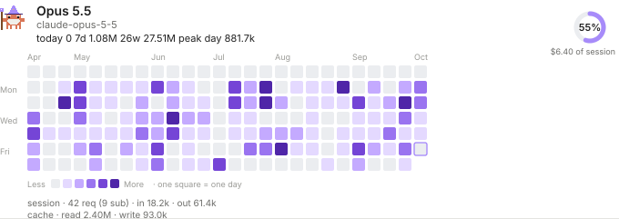
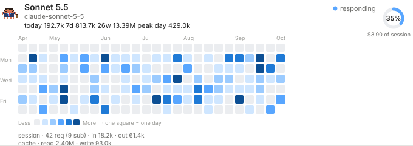
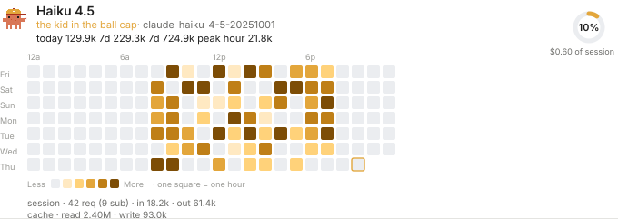
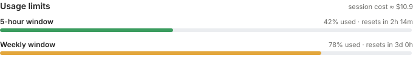

# model-usage

A [Claude Code](https://claude.com/claude-code) mod that shows how much of each model you use. One `/model-usage` command opens a pane with a card per model: a GitHub-style activity graph of token usage, a pixel-art crab in a costume per model family, a dial with the model's share of the session cost, and the account's usage limits at the bottom.

<p align="center">
  <br>
  <br>
  <br>
  <br>
  
</p>

> The images above are drawn by the mod's own code from made-up sample data. They show the layout, not real usage. They are static: in Claude Code the crabs walk while their model is answering.

## What it shows

**One card per model.** Every model that answered a request is listed, busiest first, in its own bordered section.

- **Activity graph.** One square per day or per hour, shaded in five steps relative to that model's busiest square, in the model's own color. Hover a square for its exact date or hour and token count. Today's square is outlined, and the strongest squares twinkle.
- **Timeframe.** Four buttons choose the window, and the grid changes shape to match:

  | Timeframe | Grid | One square is |
  | --- | --- | --- |
  | 24 hours | one row of 24 squares | an hour |
  | 7 days | a row per weekday, 24 columns | an hour |
  | 30 days | a column per week, Sunday to Saturday | a day |
  | 6 months | up to 28 weeks, as wide as the pane allows | a day |

- **Pixel crab.** Each family gets a costume. The crab walks while that model is answering a request and a "responding" dot pulses next to it.

  | Family | Character |
  | --- | --- |
  | Haiku | a kid in a baseball cap, tossing a ball |
  | Sonnet | a young professional with glasses, a tie and a briefcase |
  | Opus | an old sage with a starry hat, a long beard and a glowing staff |
  | anything else | the plain crab |

- **Cost share dial.** A ring with the percentage of this session's estimated cost that came from this model, and the dollar amount under it. For example, if Opus cost $6.40 of a $11.00 session, its dial reads 58%.
- **Numbers.** Today, the last 7 days, the window total and the peak hour or day. Under the graph: this session's requests (and how many came from subagents), input and output tokens, and cache reads and writes.

**Summary tiles.** Models seen, requests this session, tokens today.

**Usage limits.** Under all the models, one bar per rate-limit window your account reports (5-hour, weekly, or a gateway spend limit): percent used, time until reset, colored green, amber from 70% and red from 90%. The session cost as Claude Code totals it is shown in the header. This section refreshes after every request and every 30 seconds.

**Terminal.** On a surface without SVG support (the terminal UI) the same content is drawn as text: colored `■` squares for the graph, block characters for the bars, and a small text sprite for each model.

**Status line.** A short entry such as `3 models · 412k tok` stays in the status line.

## Install

Mods are built on function hooks, an early-access Claude Code API, tested here on Claude Code 2.1.295. It may change between releases.

### From the marketplace

In Claude Code:

```
/plugin marketplace add j-byte-s-industries/claude-helpers
/plugin install model-usage@claude-helpers
```

Start a new session afterwards. If the mod does not show up, load it by hand as below.

### By hand, for every session

```bash
git clone https://github.com/j-byte-s-industries/claude-helpers.git ~/claude-helpers
```

`git pull` in the clone updates it. Then add the plugin folder to `CLAUDE_CODE_PLUGIN_DIRS` through `env` in `~/.claude/settings.json`. Separate several folders with `:`, and append to the value if it is already set rather than replacing it:

```json
{
  "env": {
    "CLAUDE_CODE_PLUGIN_DIRS": "~/claude-helpers/plugins/model-usage"
  }
}
```

This works for the desktop app too. A mod loaded this way is read when a session starts, so start a new session after installing or updating it.

### For one session

```bash
claude --plugin-dir ~/claude-helpers/plugins/model-usage
```

## Use

Type `/model-usage` to open the pane. Press a timeframe button to change the window. The pane fills in as you work: the graph needs a few days of use before it looks like the previews, and the 24-hour and 7-day views only have data from the day you installed the mod.

## How it works

- **Counting.** A `turn.step` hook sees every model request in the session, the main thread's and subagents', with the token counts and the model id that answered. It adds them to a per-model tally. While a request is in flight, the model is marked as responding.
- **What the graph counts.** Input tokens + output tokens + cache-write tokens. Cache reads are left out on purpose: they are large and reflect how much context was re-read, not how much you worked.
- **History.** Daily totals are kept for 200 days and hourly totals for 8 days, in the plugin's own store (`$.store`, a JSON file under your Claude Code config folder). Nothing leaves your machine, and no network call is made by the mod. The session tallies live in the host's session state and start over with each session.
- **Cost share.** Each model's session tokens are priced with the `PRICES` table in `hooks/register.tsx` (USD per million tokens: input, output, cache read, cache write) and divided by the total across models. The table is a rough estimate, not a bill, so it can differ from the session cost Claude Code reports. Edit the table if prices change or a model is missing; unknown models fall back to a default rate.
- **Usage limits.** Read from `$.session.usage()`, the same figures the status line has. The section says so when there is no reading yet, for example without a subscription or before the first response finishes.
- **Drawing.** On the desktop app each card is one SVG (colors follow light and dark mode, and animation stops under reduced motion). On the terminal the same data is drawn with text elements. If the drawing code throws, the pane shows the error in red instead of staying blank.

## Files

```
.claude-plugin/plugin.json        manifest
.claude-plugin/marketplace.json   the catalog `/plugin marketplace add` reads
hooks/hooks.json                  points at the hooks module
hooks/register.tsx                the mod: hooks, drawing, price table
hooks/*.test.ts                   tests
types/index.d.ts                  the $.state contract
docs/                             preview images, drawn from sample data
```

## Development

```bash
claude plugin validate plugins/model-usage
claude plugin test plugins/model-usage
```

The tests check that `/model-usage` opens the pane and that the pane draws on both the desktop and terminal surfaces. The test kit has no `$.state` host, so the counting path itself (tallies, daily and hourly history) is not covered by a test; the pane is mounted against a small in-memory stand-in for state. Changes to a mod loaded through `CLAUDE_CODE_PLUGIN_DIRS` show up in the next session. Use `claude --plugin-dir` while iterating.

## Limits

- It counts what this install sees. Usage from other machines or from claude.ai is not in the graph (the limits section does reflect the whole account).
- History starts when the mod is installed.
- Costs are estimates (see above).
- Mods are an early-access API and may break between Claude Code releases.

## Credits

The progress panel of [savvy-progress](https://github.com/johnnyvizz/claude-kit/tree/main/plugins/savvy-progress) by johnnyvizz was the visual inspiration: SVG rows, the pixel crab, the stat tiles and the twinkling pixels. The pixel crab is in the style of Clawd from that project, and the costumes here are new.

## License

MIT, see [LICENSE](../../LICENSE).
